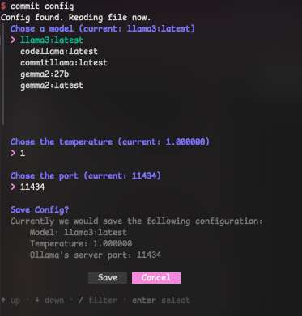

# Ollama Commit

Ollama Commit is a tool designed to help developers generate concise and descriptive commit messages based on the changes in their Git repository. By leveraging a local AI model, it ensures that commit messages follow a specific format and are both informative and standardized.

## Installation

> [!NOTE]
> Currently only the self-installation via go-cli and manually setting the PATH is available. This will change in the future. ([see here](./TODO.md))

1. **Clone the Repository**:

   ```sh
   git clone https://github.com/HaseFlrn/ollama_commit.git
   cd ollama_commit
   ```

2. **Install Dependencies**:
   Ensure you have Go installed. Then, run:

   ```sh
   go mod tidy
   ```

3. **Build the Project**:

   ```sh
   go build -o ollama_commit
   ```

4. **Add to PATH variables or add an alias to your shell-rc file**

## Usage

1. **Start Ollama**:
   Initially you might need to start the ollama server if not already running. To do so run:

   ```sh
   ollama serve
   ```

   Make sure you have at least one model installed. For a list of models see [here](https://ollama.com/library). You can also create your own model based on any of the listed models. If you are interested in that, have a look [here](https://github.com/ollama/ollama?tab=readme-ov-file#customize-a-model) To do so run:

   ```sh
   ollama pull <modelname>
   ```

2. **Run the Tool**:
   Navigate to your Git repository and run:

   ```sh
   ollama_commit
   ```

3. **Follow the Prompts**:
   - The tool will check if you are inside a Git repository.
   - It will then generate a commit message based on the staged changes.
   - You will be prompted to confirm the commit message before it is committed to the repository.

## Example

<!--TODO: add sample video/gif of commiting-->

## Configuration

> [!WARNING] We don't change the port for the running ollama server, we only take the value sent by you to communicate with the server on the specified port.

You don't need to do anything here, if you don't want to. The currently used default values are:

```json
{
  "Model": "llama3:latest",
  "Ollama_Port": 11434,
  "Temperature": 1.0
}
```

  
The tool allows the user to do some configuration. As seen in the screenshot above, the user gets prompted to choose a model from a list of all currently installed ollama models. After that you can choose the temperature by typing in the (float) value. Same thing for the port while it also validates, that the typed value fits into default port constraints.

## Contributing

Contributions are welcome! Please fork the repository and submit a pull request.

## License

This project is licensed under the Apache-2.0. See the LICENSE file for details.
